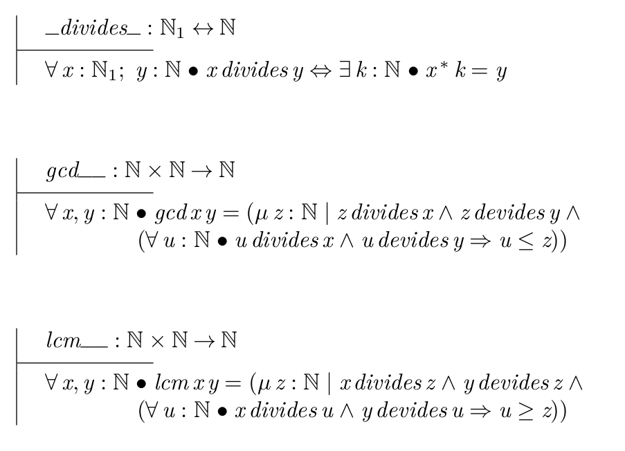
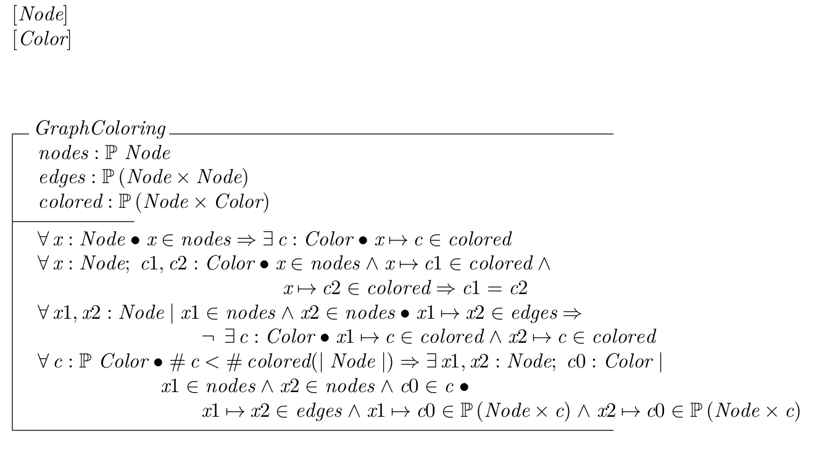

# Assingments-01

## Finding GCD and LCM of two numbers Specification

|  | 
|:--:| 
| *specification with Z-notation* |

## Graph Coloring with Minimum Colors Specification

|  | 
|:--:| 
| *specification with Z-notation* |
