# Assingments-02

## Tic-tac-toe Game Specification

| 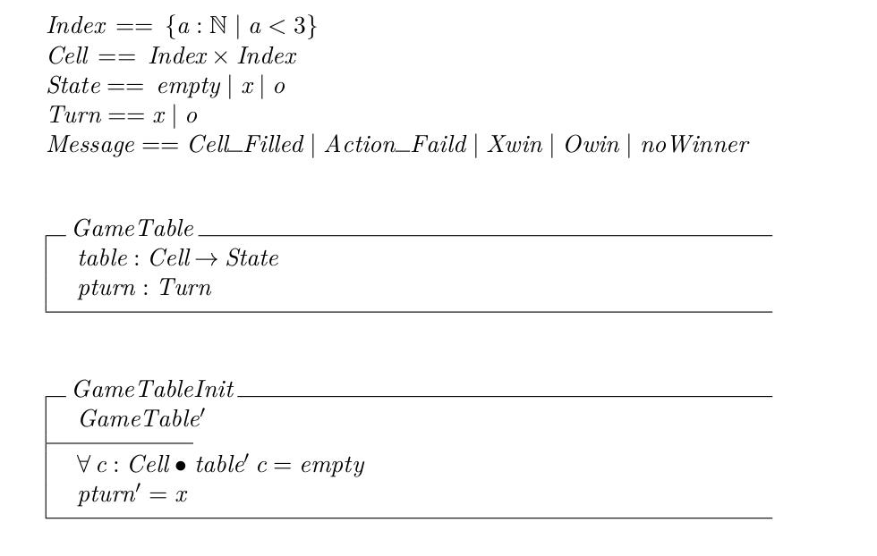 | 
|:--:| 
| *part01* |

| 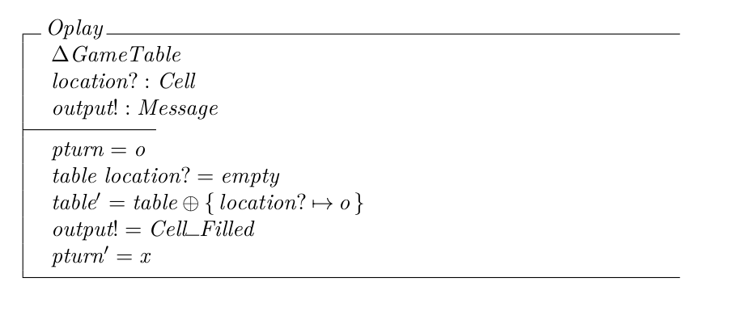 | 
|:--:| 
| *part02* |

| 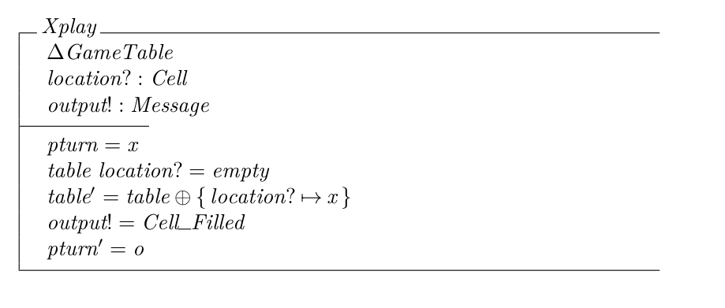 | 
|:--:| 
| *part03* |

| 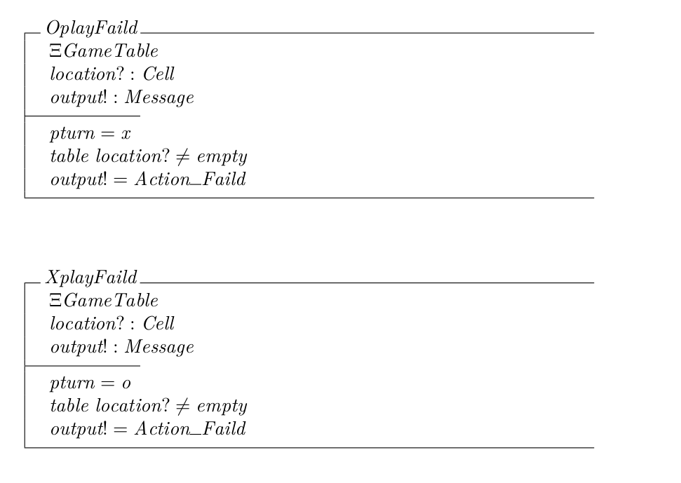 | 
|:--:| 
| *part04* |

| 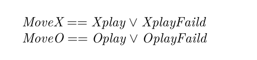 | 
|:--:| 
| *part05* |

| 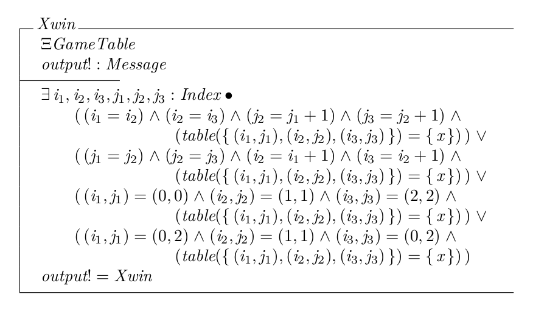 | 
|:--:| 
| *part06* |

| 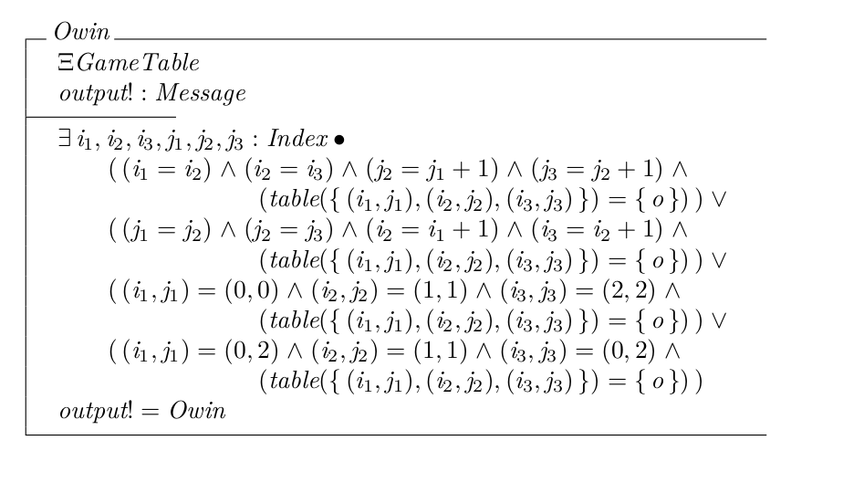 | 
|:--:| 
| *part07* |

| 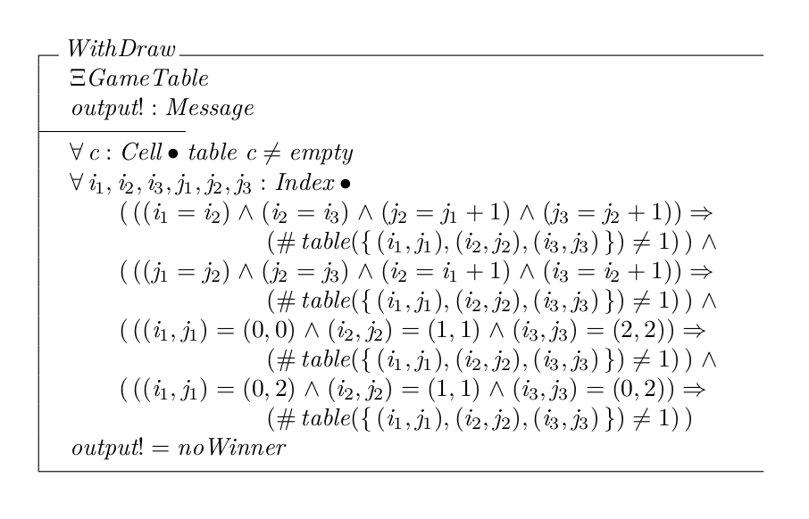 | 
|:--:| 
| *part08* |

| 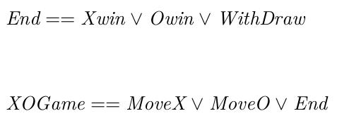 | 
|:--:| 
| *part09* |

## Pac-Man Game Specification

| 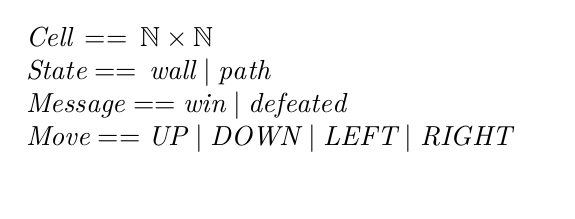 | 
|:--:| 
| *part01* |

| 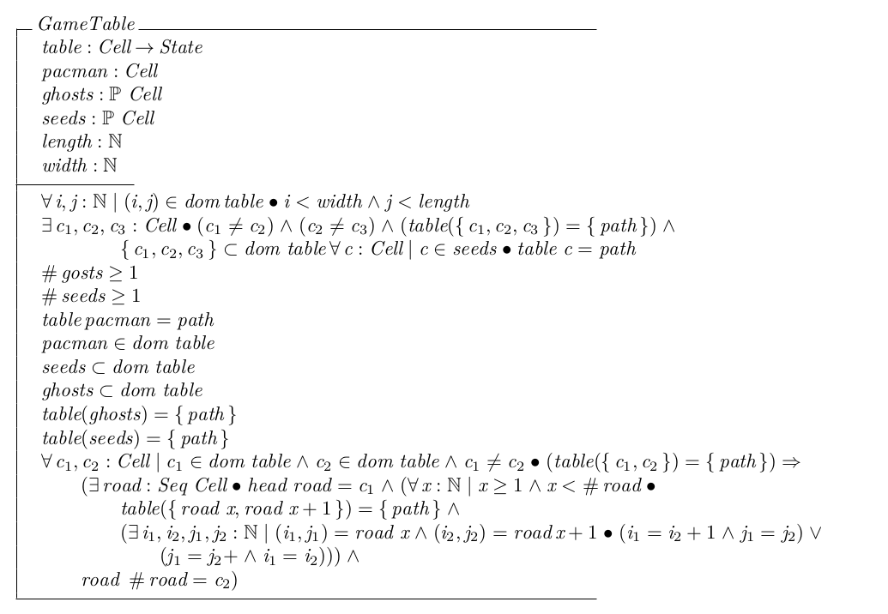 | 
|:--:| 
| *part02* |

| 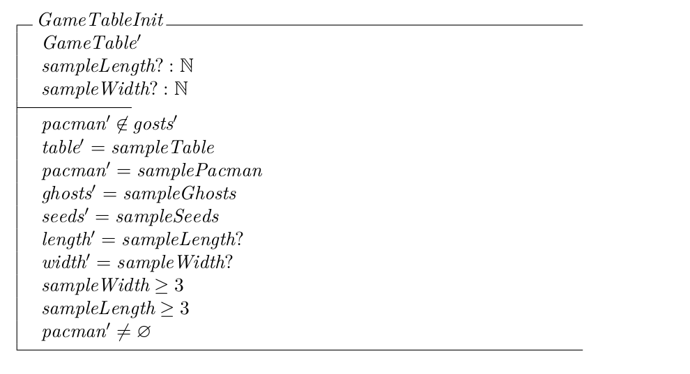 | 
|:--:| 
| *part03* |

| 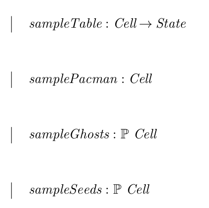 | 
|:--:| 
| *part04* |

| 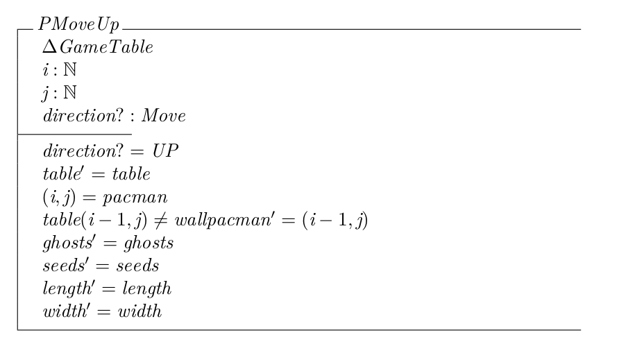 | 
|:--:| 
| *part05* |

| 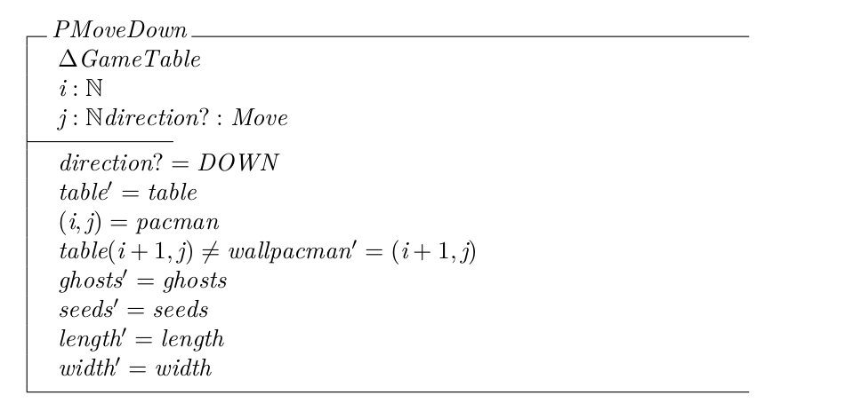 | 
|:--:| 
| *part06* |

| 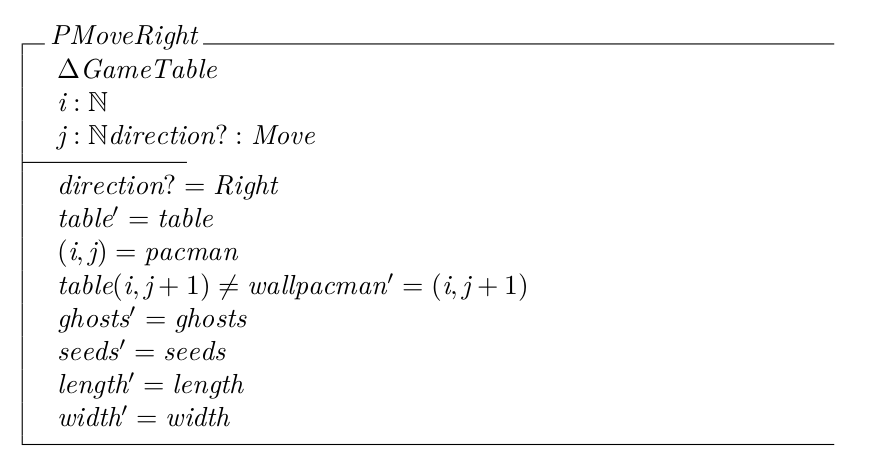 | 
|:--:| 
| *part07* |

| 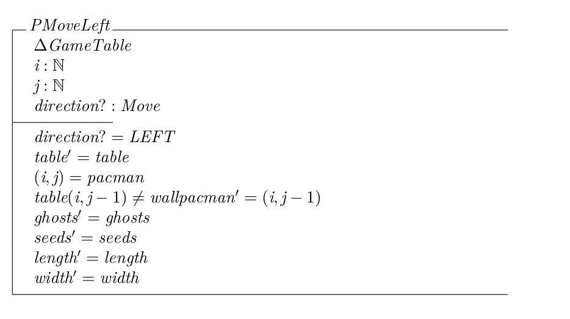 | 
|:--:| 
| *part08* |

| 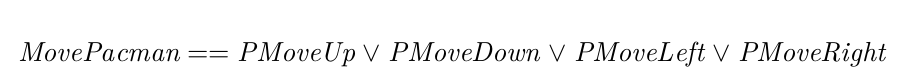 | 
|:--:| 
| *part09* |

| 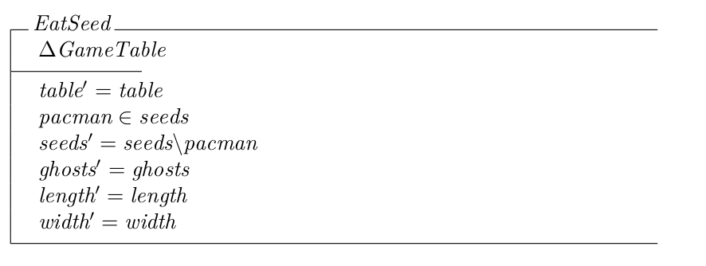 | 
|:--:| 
| *part10* |

| 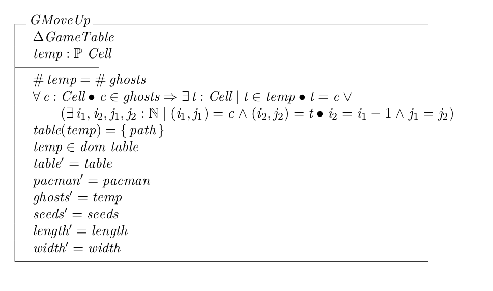 | 
|:--:| 
| *part11* |

| 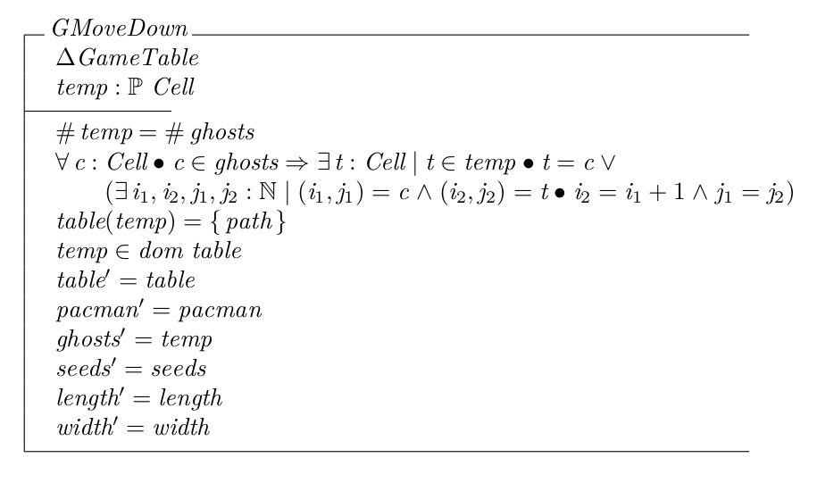 | 
|:--:| 
| *part12* |

| 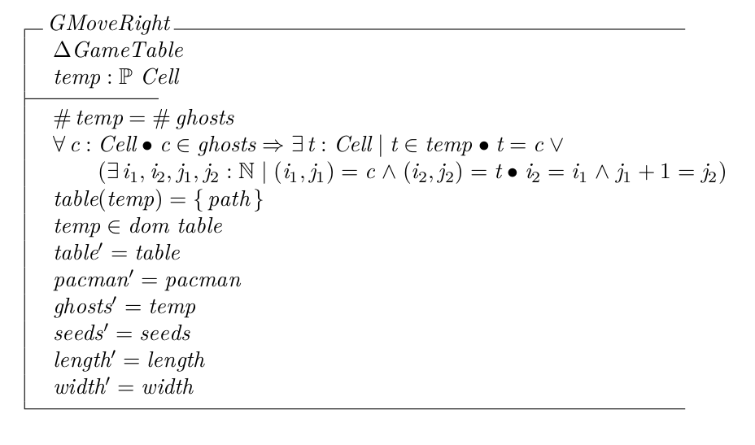 | 
|:--:| 
| *part13* |

| 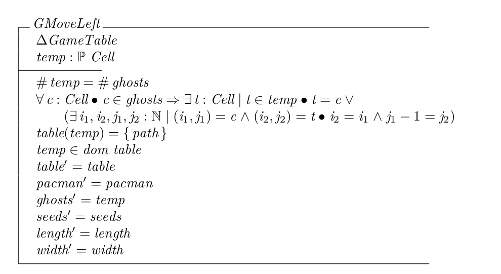 | 
|:--:| 
| *part14* |

| 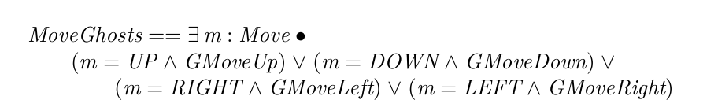 | 
|:--:| 
| *part15* |

| 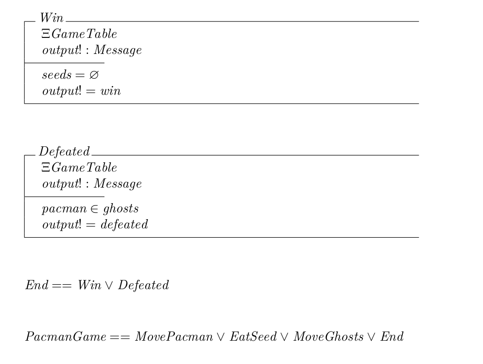 | 
|:--:| 
| *part16* |

