# Assingments-04

My 4th project was in the "Formal Specification and Verification of Programs" course when I was in the 1st semester of my master's at SUT. In this project I formally specified a Family Payment Systems.

## Family Payment Systems

| 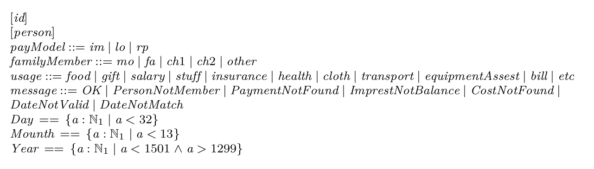 | 
|:--:| 
| *part01* |

| 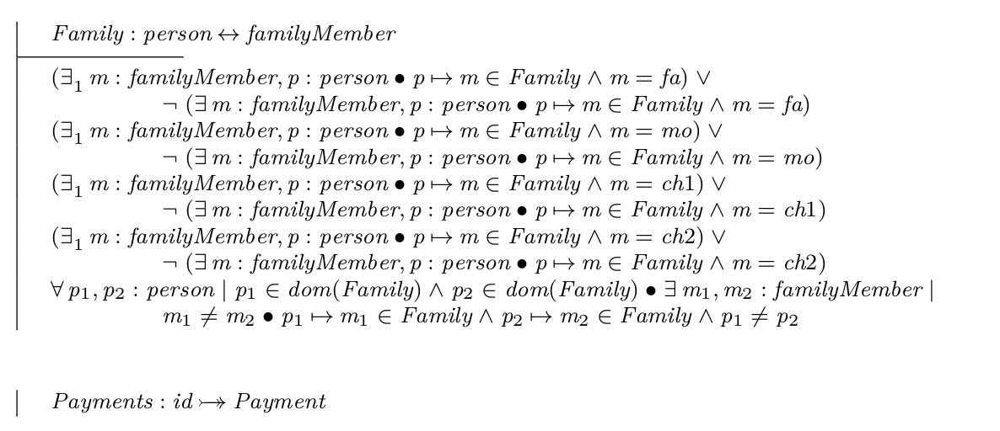 | 
|:--:| 
| *part02* |

| 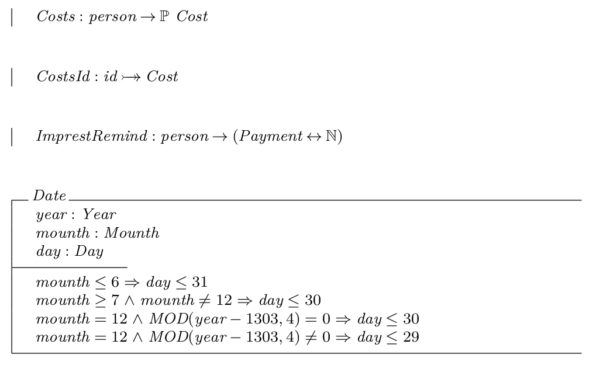 | 
|:--:| 
| *part03* |

| 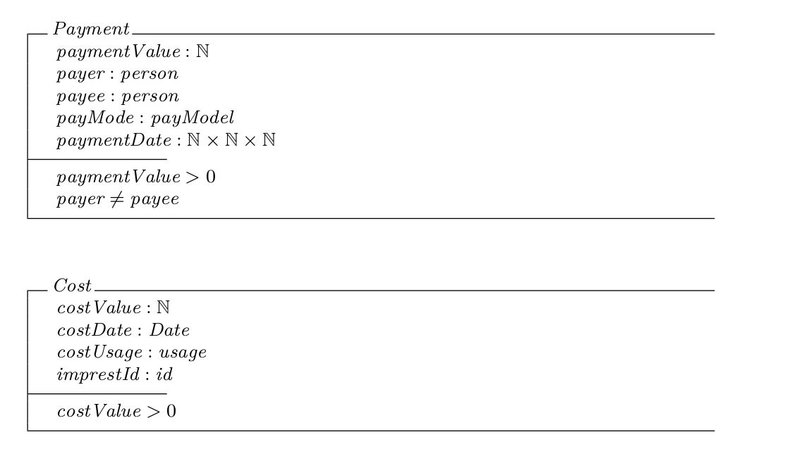 | 
|:--:| 
| *part04* |

| 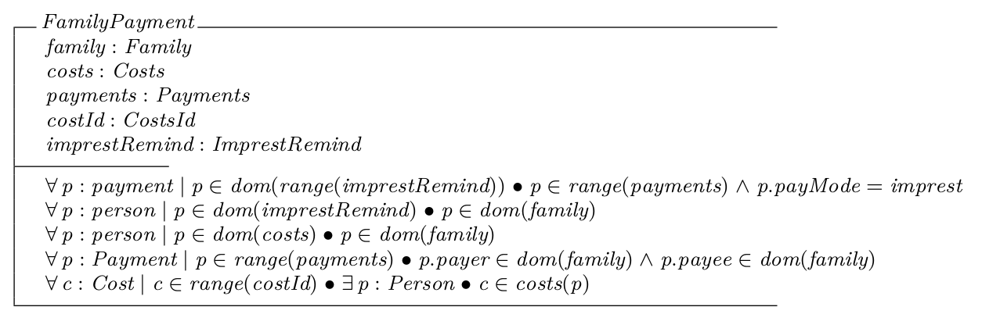 | 
|:--:| 
| *part05* |

| 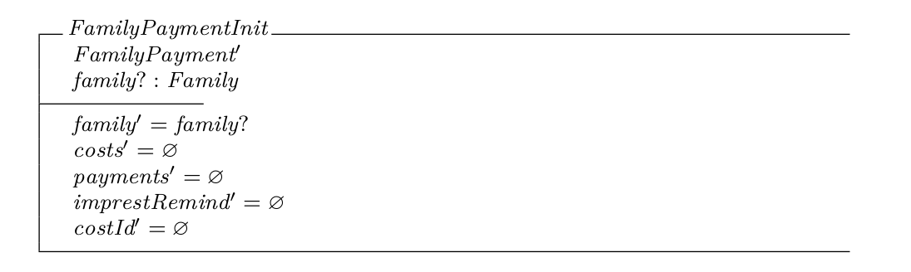 | 
|:--:| 
| *part06* |

| 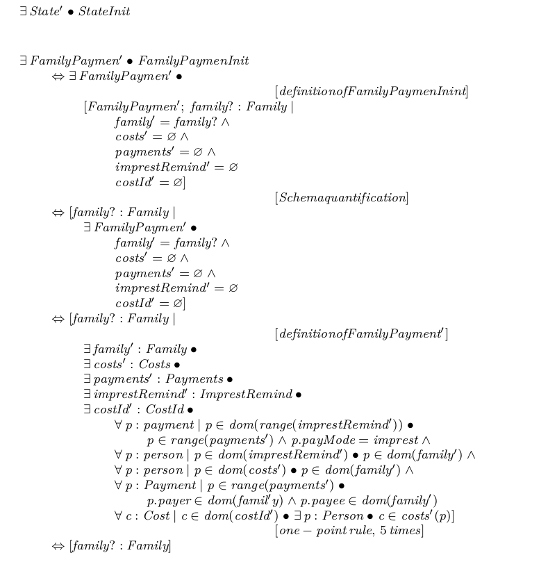 | 
|:--:| 
| *part07* |

| 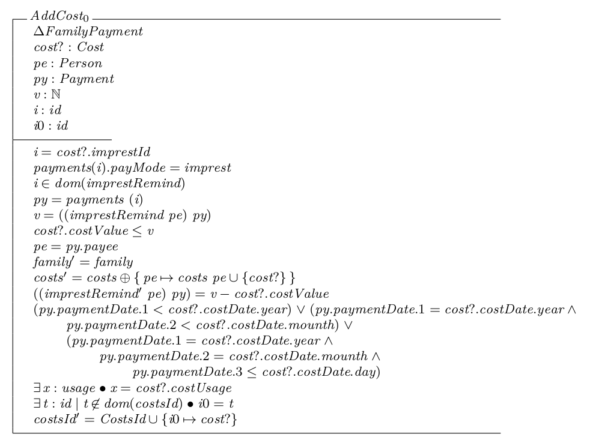 | 
|:--:| 
| *part08* |

| 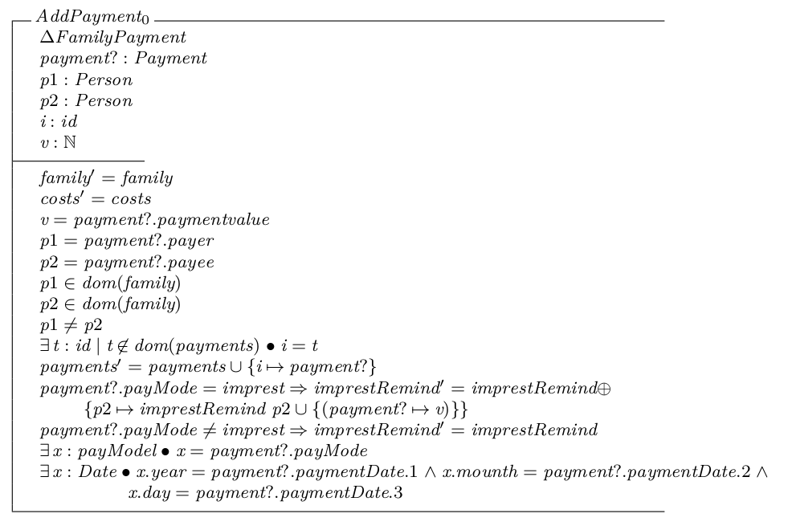 | 
|:--:| 
| *part09* |

| 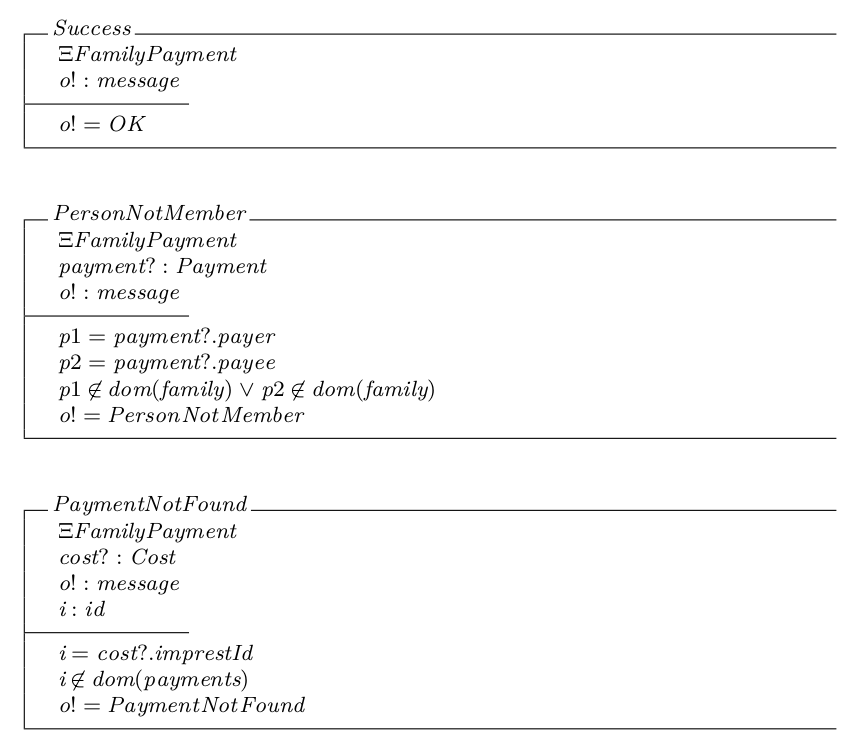 | 
|:--:| 
| *part10* |

| 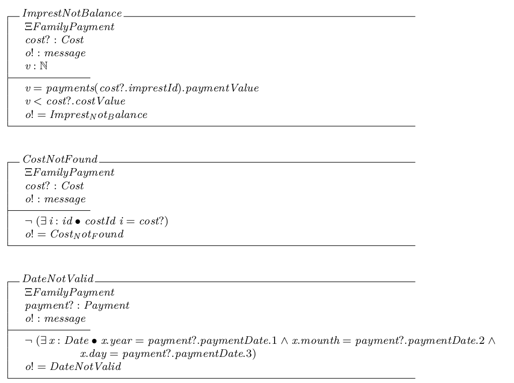 | 
|:--:| 
| *part11* |

| 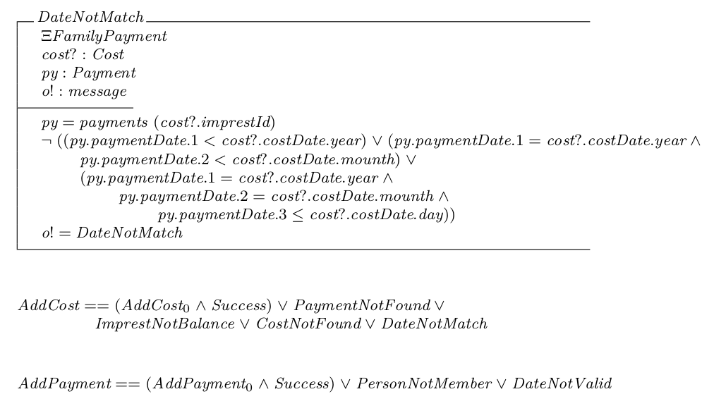 | 
|:--:| 
| *part12* |

| 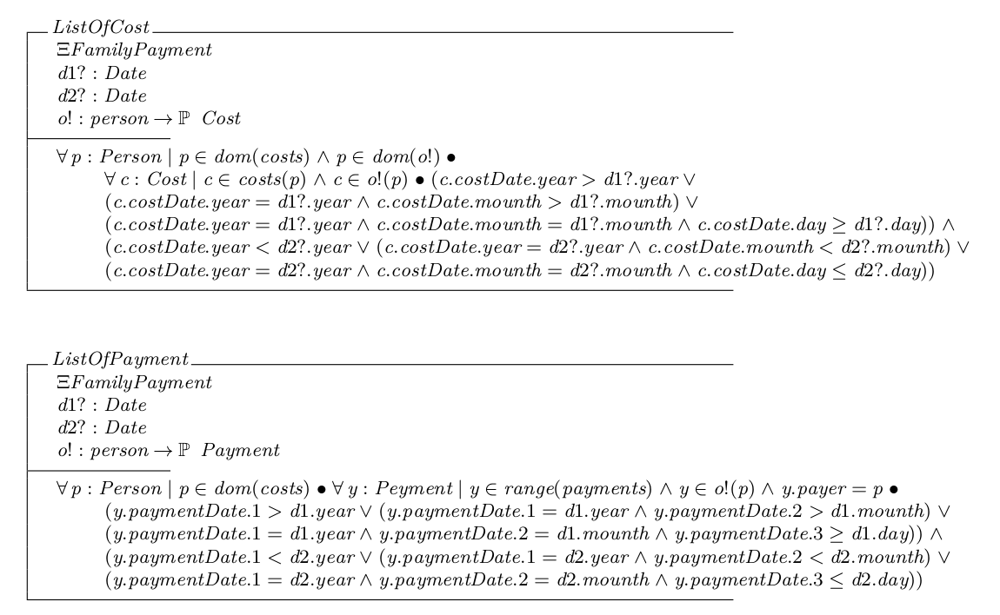 | 
|:--:| 
| *part13* |

| 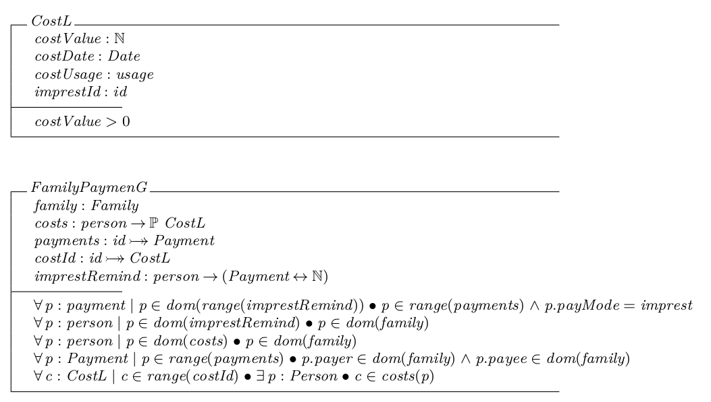 | 
|:--:| 
| *part14* |

| 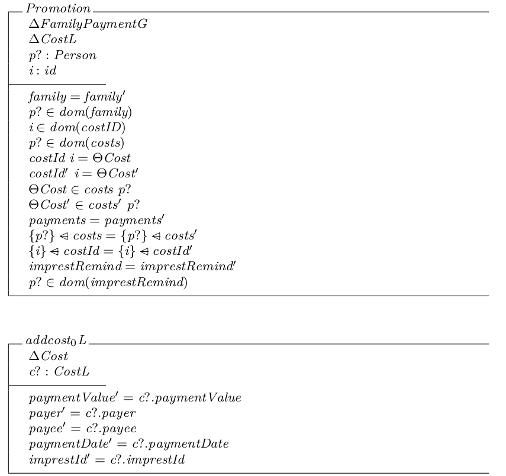 | 
|:--:| 
| *part15* |

| 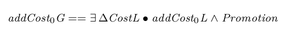 | 
|:--:| 
| *part16* |

| 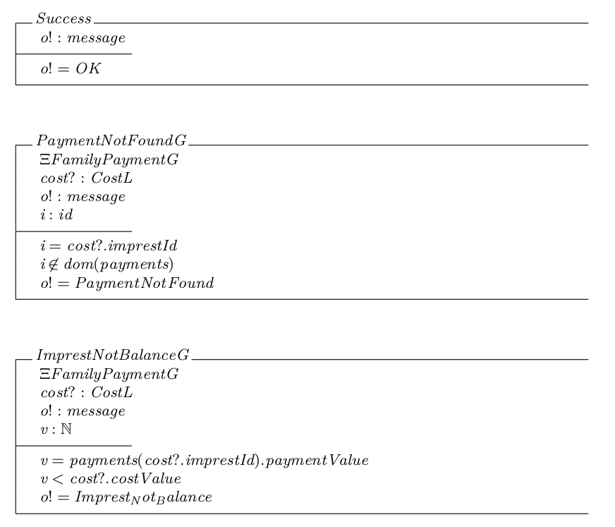 | 
|:--:| 
| *part17* |

| 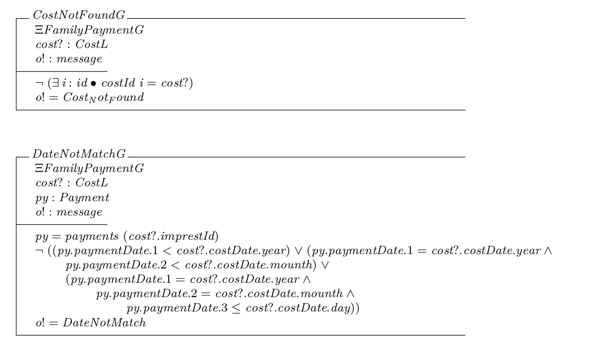 | 
|:--:| 
| *part18* |

| 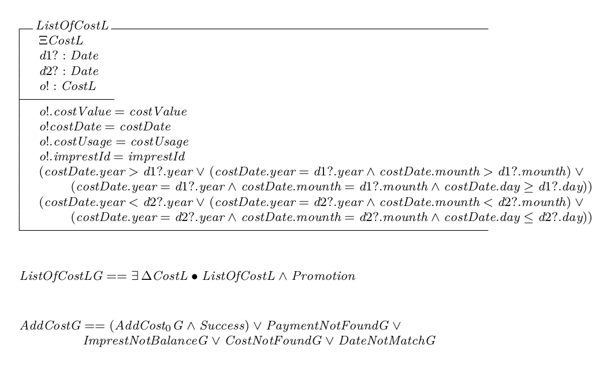 | 
|:--:| 
| *part19* |
